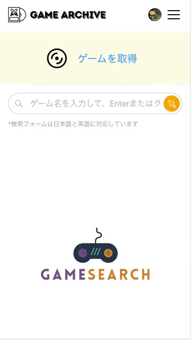
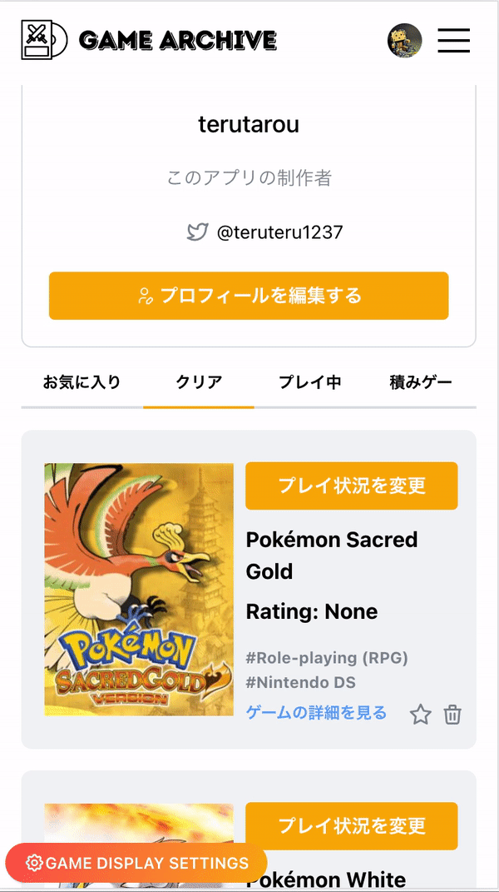
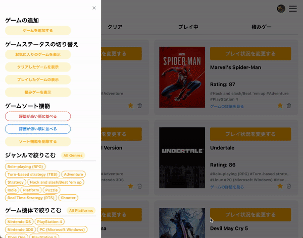
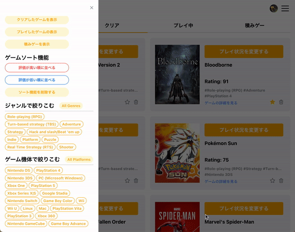
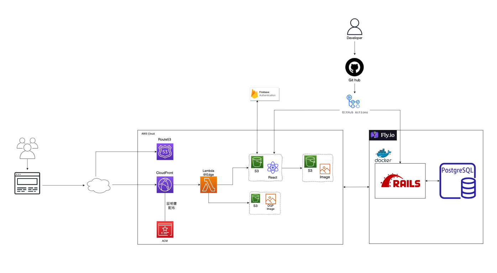
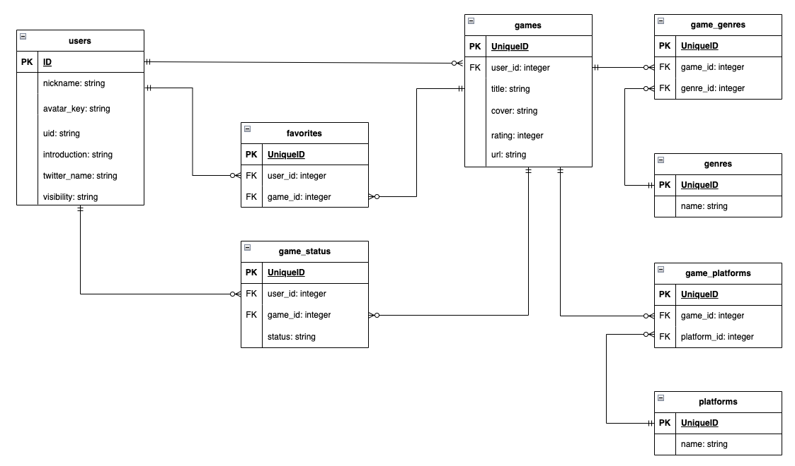

GameArchiveは、ゲームエンターテイメントをより管理しやすくするための一体型データベースサービスです。

ユーザーはゲームの状況に応じて（例：クリア、プレイ中、積みゲー）、様々なゲーム情報を取得して保存することができます。取得したゲームは、画像、タイトル、評価値、ジャンル、プラットフォーム、外部サイトへのURLなど、多彩なデータとともに管理されます。

▼**サービス URL**

https://gamearchiveapp.com/

 

---

 

## 主な機能

### ゲーム取得機能（検索・取得）

| ゲーム検索機能                                                                                                                    | ゲーム取得機能                                                                                                                |
| ----------------------------------------------------------------------------------------------------------------------------------- | ------------------------------------------------------------------------------------------------------------------------------------|
|  |  |
| 外部APIからゲームしデータを取得できます。                                                  | ゲームステータスを入力してからゲームを保存できます。（**ログインユーザー限定**）                                 |

 

### マネジメント機能

| ゲームステータス変更                                                                                                                    | お気に入り                                                                                                                | ゲーム削除                                                                                                                                                   |
| ----------------------------------------------------------------------------------------------------------------------------------- | ----------------------------------------------------------------------------------------------------------------------------------- | ---------------------------------------------------------------------------------------------------------------------------------------------------------- |
|  |  |                         |
| マネジメントページではいつでもゲームステータスが変更可能です。（**ログインユーザー限定**）                                                  | 星マークのタップでお気に入りの作成と削除ができます。 （**ログインユーザー限定**）                                 | ゴミ箱マークをタップすることによって、ゲームの削除もできます。（**ログインユーザー限定**） |

| ゲームソート機能                                                                                                                            | genreとplatform絞り込み機能                                                                                                            |
| :---------------------------------------------------------------------------------------------------------------------------------- | ----------------------------------------------------------------------------------------------------------------------------------- |
|  |  |
|  左下の画面設定からソート機能が使えます。 （**ログインユーザー限定**）                                 | ゲームジャンルとプラットフォームで絞り込み表示ができます。（**ログインユーザー限定**） |

 

---

 

## 主な使用技術

### フロントエンド

- [React](https://ja.reactjs.org/)
- [TypeScript](https://www.typescriptlang.org/)
- [TailwindCSS](https://tailwindcss.com/)
- [Mantine](https://mantine.dev/)

### バックエンド

- [Ruby on Rails（API モード）](https://rubyonrails.org/)

### インフラ

- [Fly.io](https://fly.io/)
- [AWS](https://aws.amazon.com/jp)
  - [Route53](https://aws.amazon.com/jp/route53/)
  - [CloudFront](https://aws.amazon.com/jp/cloudfront/)
  - [S3](https://aws.amazon.com/jp/s3/)
  - [Certificate Manager](https://aws.amazon.com/jp/certificate-manager/)
  - [Lambda@Edge](https://aws.amazon.com/jp/lambda/edge/)

### CI/CD

- [GitHub Actions](https://docs.github.com/ja/actions)

※フロント側は husky&lint-staged を用いて pre-commit 時に ESLint、Prettier を実行してコードの品質を保っています

### 環境構築

- [Docker](https://www.docker.com/)
- [docker-compose](https://docs.docker.jp/compose/toc.html)
- [Vite](https://ja.vitejs.dev/)

### 外部サービス

- [Firebase Authentication](https://firebase.google.com/docs/auth?hl=ja)
- [IGDB API](https://api-docs.igdb.com/#getting-started)
- [Cloud Translation API](https://cloud.google.com/translate/docs/overview?hl=ja)

 

---

 

## インフラ構成図

 

## ER 図

 

## 画面遷移図

[Figma](https://www.figma.com/file/Q7spu5GNfKmQ4yPmKwGMDF/gamer_achirve?type=design&node-id=0-1&mode=design&t=wLfMSytfvp6mbMJh-0)

 

## コンポーネント設計

- [Figma](https://www.figma.com/file/Ayi6NyjFxucQoZnR9Q1D8v/game_achirve%E3%81%AE%E3%82%B3%E3%83%B3%E3%83%9D%E3%83%BC%E3%83%8D%E3%83%B3%E3%83%88?type=design&mode=design&t=wLfMSytfvp6mbMJh-0)
- [Notion](https://teruteru214.notion.site/GameArchive-5c347f28f31649fb8f9f15d0afc81621?pvs=4)
